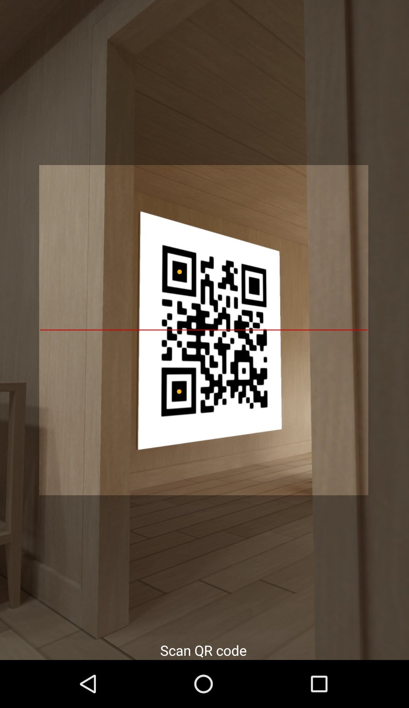
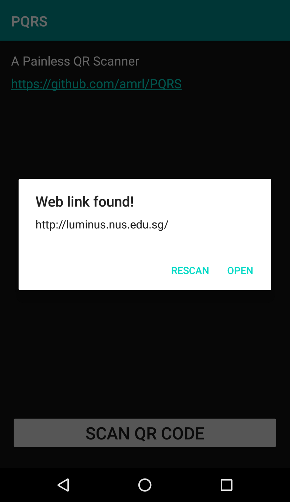

# PQRS
A **P**ainless **QR** **S**canner.

Only for web links.

Scan, view, open. Nothing else.

## Screenshots
&nbsp;&nbsp;&nbsp;&nbsp;

## Features
* Scan QR codes for web links
* View QR code content
* If the content is a web link, you have the option of opening it
* If not, you can still view the text content

## Motivations
* I only scan QR codes for web links, nothing else
* Most QR code scanners in the store request for unnecessary
permissions
* Most QR code scanners in the store contain ads

## Acknowledgements
* [zxing](https://github.com/zxing/zxing)
* [zxing-android-embedded ](https://github.com/journeyapps/zxing-android-embedded)
